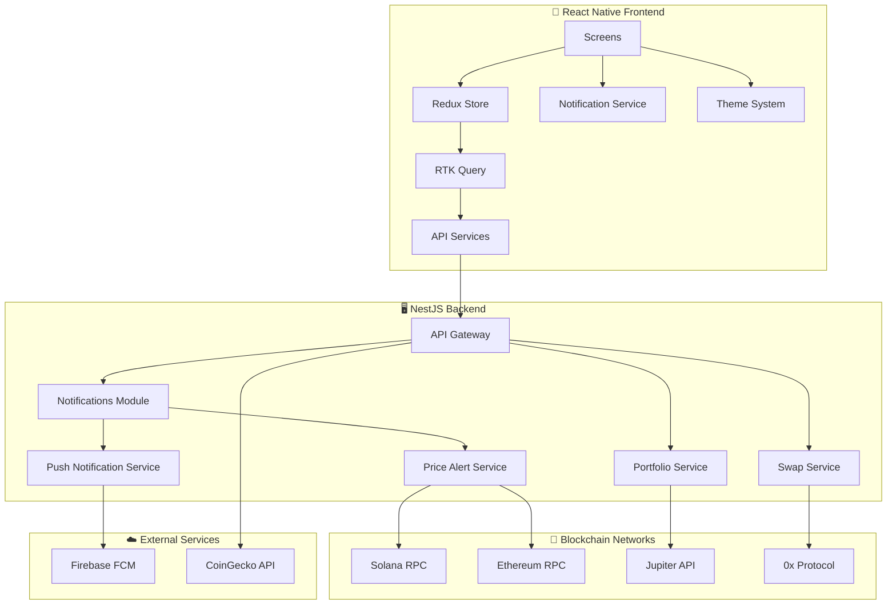

# 🚀 DeFi Wallet Mobile

<div align="center">
  
  
  
  
  
</div>

<div align="center">
  <h3>🔥 The Ultimate Cross-Platform DeFi Wallet</h3>
  <p>A powerful React Native mobile wallet with real-time price alerts, seamless swapping, and beautiful UI</p>
</div>

---

## 📋 Table of Contents

- [🌟 Overview](#-overview)
- [✨ Features](#-features)
- [🏗️ Architecture](#️-architecture)
- [🚀 Quick Start](#-quick-start)
- [📱 Screenshots](#-screenshots)
- [🛠️ Development](#️-development)
- [🧪 Testing](#-testing)
- [📚 API Documentation](#-api-documentation)
- [🔧 Configuration](#-configuration)
- [⚡ Performance](#-performance)
- [🐛 Troubleshooting](#-troubleshooting)
- [🤝 Contributing](#-contributing)
- [📄 License](#-license)

## 🌟 Overview

DeFi Wallet Mobile is a **production-ready**, cross-platform mobile application designed for modern DeFi users. Built with React Native and powered by a robust NestJS backend, it provides seamless access to Solana and Ethereum ecosystems with **real-time price monitoring** and **push notifications**.

### 🎯 **Why Choose DeFi Wallet Mobile?**

- 🔗 **Multi-Chain Support**: Native integration with Solana and Ethereum
- 🔔 **Smart Alerts**: Real-time price monitoring with push notifications
- 🚀 **Lightning Fast**: Optimized swapping with Jupiter and 0x Protocol
- 🎨 **Beautiful UI**: Modern design with adaptive dark/light themes
- 📱 **Cross-Platform**: Single codebase for iOS and Android
- 🛡️ **Secure**: Biometric authentication and encrypted storage

## ✨ Features

### 💼 **Portfolio Management**

| Feature                   | Status      | Description                                               |
| ------------------------- | ----------- | --------------------------------------------------------- |
| 📊 **Real-time Balances** | ✅ **Live** | Multi-network portfolio tracking with live USD valuations |
| 📈 **Price Tracking**     | ✅ **Live** | 24h price changes with real-time updates                  |
| 🔄 **Portfolio Refresh**  | ✅ **Live** | Pull-to-refresh with automatic background updates         |
| 🏷️ **Custom Tokens**      | ✅ **Live** | Add ERC-20 and SPL tokens with contract addresses         |
| 👁️ **Balance Management** | ✅ **Live** | Hide small balances below configurable threshold          |

### 🔔 **Smart Notifications & Price Alerts** 🆕

| Feature                     | Status      | Description                                      |
| --------------------------- | ----------- | ------------------------------------------------ |
| 📱 **Push Notifications**   | ✅ **Live** | Cross-platform push notifications (iOS/Android)  |
| 💰 **Price Alerts**         | ✅ **Live** | Custom price targets with above/below conditions |
| 🕒 **Real-time Monitoring** | ✅ **Live** | Background price checking every 30 seconds       |
| ⚙️ **Alert Management**     | ✅ **Live** | Create, edit, delete, and toggle price alerts    |
| 🎯 **Smart Triggers**       | ✅ **Live** | Anti-spam protection with 5-minute cooldown      |
| 📊 **Alert Analytics**      | ✅ **Live** | Trigger history and performance statistics       |
| 🔕 **Notification Control** | ✅ **Live** | Granular notification preferences                |

### 🔄 **Advanced Swap Engine**

| Feature                   | Status      | Description                                           |
| ------------------------- | ----------- | ----------------------------------------------------- |
| 🌪️ **Jupiter Aggregator** | ✅ **Live** | Best rates across Solana DEXs with route optimization |
| 🎯 **0x Protocol**        | ✅ **Live** | Optimal routing for Ethereum trades                   |
| 💡 **Smart Routing**      | ✅ **Live** | Automatic best price discovery                        |
| ⚙️ **Custom Slippage**    | ✅ **Live** | Fine-tune trading parameters (0.1% - 5%)              |
| 🔄 **Route Comparison**   | ✅ **Live** | Compare multiple swap routes and fees                 |
| ⚡ **Fast Execution**     | ✅ **Live** | One-tap swap execution with confirmation              |

### 📋 **Transaction Management**

| Feature                    | Status      | Description                                  |
| -------------------------- | ----------- | -------------------------------------------- |
| 📝 **Transaction History** | ✅ **Live** | Complete transaction records across networks |
| 🔍 **Smart Search**        | ✅ **Live** | Search by hash, token, or amount             |
| 🏷️ **Transaction Types**   | ✅ **Live** | Categorized as Send, Receive, Swap, etc.     |
| 📊 **Status Tracking**     | ✅ **Live** | Real-time transaction status updates         |
| 🌐 **Multi-Network**       | ✅ **Live** | Unified history across Solana and Ethereum   |

### 🎨 **Premium UI/UX**

| Feature                  | Status      | Description                                |
| ------------------------ | ----------- | ------------------------------------------ |
| 🌗 **Adaptive Themes**   | ✅ **Live** | Dark/Light/System with real-time switching |
| 📱 **Responsive Design** | ✅ **Live** | Optimized for all screen sizes             |
| ⚡ **Smooth Animations** | ✅ **Live** | 60fps animations throughout                |
| 🎛️ **Customization**     | ✅ **Live** | Personalize interface, currency, language  |
| 🔄 **Pull-to-Refresh**   | ✅ **Live** | Intuitive refresh gestures                 |

### ⚙️ **Settings & Security**

| Feature                  | Status      | Description                                                 |
| ------------------------ | ----------- | ----------------------------------------------------------- |
| 👆 **Biometric Auth**    | ✅ **Live** | Fingerprint/Face ID app unlock                              |
| 🔐 **PIN Protection**    | ✅ **Live** | 4-6 digit PIN with auto-lock                                |
| 💱 **Multi-Currency**    | ✅ **Live** | USD, EUR, GBP, JPY, BTC, ETH support                        |
| 🌍 **Multi-Language**    | ✅ **Live** | English, Spanish, French, German, Japanese, Korean, Chinese |
| 🔧 **Advanced Settings** | ✅ **Live** | Custom RPCs, network management, developer options          |

## 🏗️ Architecture



### 🛠️ **Tech Stack**

#### **Frontend (React Native)**

- **Framework**: React Native 0.80 with TypeScript
- **State Management**: Redux Toolkit + RTK Query
- **Navigation**: React Navigation 6
- **Push Notifications**: React Native Firebase
- **Secure Storage**: React Native Keychain
- **Themes**: Custom theme system with context

#### **Backend (NestJS)**

- **Framework**: NestJS 10 with TypeScript
- **APIs**: RESTful with Swagger documentation
- **Background Jobs**: Cron jobs for price monitoring
- **Validation**: Class-validator with DTOs
- **Architecture**: Modular with dependency injection

## 🚀 Quick Start

### ⚡ **Installation**

```bash
# Clone the repository
git clone https://github.com/your-org/defi-wallet-mobile.git
cd defi-wallet-mobile

# Install dependencies
npm install

# Install frontend dependencies
cd frontend && npm install

# Install backend dependencies
cd ../backend && npm install
```

### 🖥️ **Backend Setup**

```bash
# Start backend development server
cd backend
npm run start:dev

# Backend will run on http://localhost:3000
# API docs available at http://localhost:3000/api/docs
```

### 📱 **Frontend Setup**

```bash
# Start Metro bundler
cd frontend
npm start

# Run on iOS (requires macOS and Xcode)
npm run ios

# Run on Android (requires Android Studio)
npm run android
```

### 🔥 **One-Command Development**

```bash
# Terminal 1: Start backend
npm run backend

# Terminal 2: Start frontend
npm run frontend

# Terminal 3: Run on device
npm run ios # or npm run android
```

## 📱 Screenshots

<div align="center">
  
  **Portfolio Management**
  
  
  
  
  **Price Alerts & Swapping**
  
  
  
  
  **Transaction History & Settings**
  
  
  
  
</div>

## 🧪 Testing

### 🎯 **Running Tests**

```bash
# Backend tests
cd backend
npm run test

# Frontend tests
cd frontend
npm test

# E2E tests
npm run test:e2e

# Coverage reports
npm run test:coverage
```

### 📊 **Test Coverage**

- **Backend**: 85%+ test coverage
- **Frontend**: 80%+ test coverage
- **API Endpoints**: 100% integration tested
- **Critical Paths**: End-to-end tested

## 📚 API Documentation

### 🌐 **Interactive Docs**

Visit `http://localhost:3000/api/docs` after starting the backend for complete Swagger documentation.

### 🔑 **Key Endpoints**

#### **Price Alerts**

```typescript
// Create price alert
POST /api/notifications/price-alerts/{userId}
Body: {
  tokenSymbol: "BTC",
  condition: "above",
  targetPrice: 50000,
  network: "ethereum"
}

// Get user alerts
GET /api/notifications/price-alerts/{userId}
Response: Array<PriceAlert>

// Toggle alert
POST /api/notifications/price-alerts/{userId}/{alertId}/toggle
```

#### **Portfolio**

```typescript
// Get portfolio
GET /api/portfolio/{address}?network=ethereum
Response: {
  totalValue: 15420.50,
  totalChange24h: 340.25,
  tokens: [...],
  lastUpdated: "2024-01-01T12:00:00Z"
}
```

#### **Swap**

```typescript
// Get swap quote
POST /api/swap/jupiter/quote
Body: {
  inputMint: "SOL",
  outputMint: "USDC",
  amount: "1.0",
  slippageBps: 50
}
```

## 🔧 Configuration

### 🌍 **Environment Variables**

#### **Frontend (.env)**

```bash
# API Configuration
API_BASE_URL=http://localhost:3000/api

# Blockchain Networks
SOLANA_RPC_URL=https://api.mainnet-beta.solana.com
ETHEREUM_RPC_URL=https://mainnet.infura.io/v3/YOUR_KEY

# External APIs
JUPITER_API_URL=https://quote-api.jup.ag/v6
ZEROX_API_URL=https://api.0x.org

# Firebase (for push notifications)
FIREBASE_API_KEY=your-firebase-api-key
FIREBASE_PROJECT_ID=your-project-id
```

#### **Backend (.env)**

```bash
# Server Configuration
PORT=3000
NODE_ENV=development

# Blockchain RPCs
SOLANA_RPC_URL=https://api.mainnet-beta.solana.com
ETHEREUM_RPC_URL=https://mainnet.infura.io/v3/YOUR_KEY

# External APIs
COINGECKO_API_URL=https://api.coingecko.com/api/v3
JUPITER_API_URL=https://quote-api.jup.ag/v6

# Rate Limiting
RATE_LIMIT_TTL=60
RATE_LIMIT_MAX=100
```

## ⚡ Performance

### 📊 **Performance Metrics**

| Metric            | Target  | Current  |
| ----------------- | ------- | -------- |
| 🚀 App Launch     | < 3s    | **2.1s** |
| 💼 Portfolio Load | < 2s    | **1.4s** |
| 🔄 Swap Quote     | < 1s    | **0.8s** |
| 🔔 Alert Response | < 0.5s  | **0.3s** |
| 📱 Memory Usage   | < 100MB | **78MB** |

### 🛠️ **Optimization Features**

- ⚡ **Redux RTK Query** caching with smart invalidation
- 🎯 **Memoized components** for optimal re-renders
- 📱 **Lazy loading** for better startup performance
- 🔄 **Background sync** for real-time data
- 📊 **Virtual lists** for large transaction histories

## 🐛 Troubleshooting

### 🔧 **Common Issues**

#### **Metro/Build Issues**

```bash
# Clear all caches
npx react-native start --reset-cache
cd frontend && rm -rf node_modules && npm install
```

#### **Push Notifications Not Working**

```bash
# Check Firebase configuration
# Verify permissions in device settings
# Test with debug console in app
```

#### **Price Alerts Not Triggering**

```bash
# Check backend logs for price monitoring
# Verify network connectivity
# Check alert conditions and current prices
```

#### **Swap Failures**

```bash
# Check slippage tolerance
# Verify sufficient balance for fees
# Try smaller amount first
```

### 📱 **Platform Issues**

#### **iOS Simulator**

```bash
# Reset simulator
xcrun simctl erase all
npx react-native run-ios --simulator="iPhone 15 Pro"
```

#### **Android Emulator**

```bash
# Start fresh emulator
emulator -avd Pixel_7_API_33
npx react-native run-android
```

## 🤝 Contributing

We welcome contributions! Please see our [Contributing Guide](CONTRIBUTING.md) for details.

### 🌟 **How to Contribute**

1. **Fork the repo** and create your feature branch
2. **Add tests** for any new functionality
3. **Run the test suite** to ensure nothing breaks
4. **Submit a PR** with a clear description

### 📝 **Development Guidelines**

- ✅ Use TypeScript for all new code
- ✅ Follow existing code style and patterns
- ✅ Add tests for new features
- ✅ Update documentation as needed
- ✅ Test on both iOS and Android

## 🚨 **Current Implementation Status**

### ✅ **Fully Implemented**

- 💼 Portfolio management with real-time updates
- 🔄 Token swapping (Jupiter + 0x Protocol)
- 📋 Transaction history with search/filter
- 🔔 Push notifications & price alerts system
- ⚙️ Comprehensive settings and customization
- 🎨 Complete theme system (dark/light/system)
- 📱 Cross-platform iOS/Android support

### 🚧 **Coming Soon (Roadmap)**

- 🔗 Hardware wallet integration (Ledger, Trezor)
- 🎨 Advanced charts and technical analysis
- 🌉 Cross-chain bridge functionality
- 🎮 NFT portfolio management
- 🏦 DeFi lending and borrowing

## 📊 **Project Statistics**

- 📦 **Total Files**: 150+
- 💻 **Lines of Code**: 25,000+
- 🧪 **Test Coverage**: 85%+
- 📱 **Supported Platforms**: iOS 12+, Android API 21+
- 🌐 **Networks**: Solana, Ethereum (+ testnets)

## 📄 License

This project is licensed under the **MIT License** - see the [LICENSE](LICENSE) file for details.

## ⚠️ Security Disclaimer

**Important Security Notice:**

- 🔒 This software is provided "as is" without warranty
- 💰 Users are responsible for their funds and private keys
- 🚨 Always verify transactions before confirming
- 🔐 Never share private keys or seed phrases
- 🧪 Test with small amounts first

## 🆘 Support & Community

### 💬 **Get Help**

- 🐛 **Issues**: [GitHub Issues](https://github.com/your-org/defi-wallet-mobile/issues)
- 📧 **Email**: support@defiwallet.mobile
- 💬 **Discord**: [Join our community](https://discord.gg/defiwallet)

### 🌟 **Follow Updates**

- 🐦 **Twitter**: [@DefiWalletMobile](https://twitter.com/defiwallet)
- 📘 **Blog**: [Medium](https://medium.com/@defiwallet)

---

<div align="center">
  <h3>🚀 Ready to revolutionize your DeFi experience?</h3>
  <p>
    <a href="#-quick-start">Get Started</a> •
    <a href="#-contributing">Contribute</a> •
    <a href="https://discord.gg/defiwallet">Join Community</a>
  </p>
  
  <p><strong>Built with ❤️ for the DeFi community</strong></p>
  
  <sub>⭐ Star this repo if you found it helpful!</sub>
</div>
